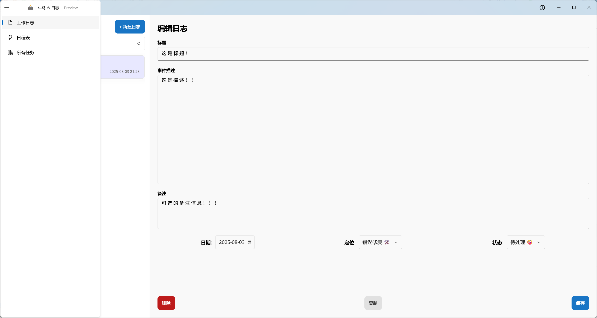

# WorkLog - 程序员的极简工作日志

WorkLog 是一款专为程序员设计的、简洁高效的桌面工作日志应用。它旨在帮助开发者快速记录、追踪和回顾日常的编程任务、Bug修复和技术学习过程。本项目使用 .NET MAUI 构建，专注于提供流畅、原生的Windows桌面体验。




## ✨ 项目特性

- **快速录入**: 简洁的界面设计，包含独立的标题和描述区，让你能迅速记录日志的核心内容。
- **动态列表**: 在主界面左侧实时展示最近的日志事件流，支持无限滚动。
- **实时搜索**: 输入即搜索，支持对标题和描述的全文内容进行快速、去抖动的客户端内存搜索。
- **状态与类型管理**: 为每条日志定义清晰的“定位”（如功能开发、Bug修复）和“状态”（如待办、进行中、已完成）。
- **交互式UI**:
  - 所有按钮均有明确的点击动画反馈。
  - “保存”、“复制”按钮在操作成功后，会通过文本动画提供即时、非阻塞的成功提示。
  - 交互按钮（如“删除”、“复制”）会根据上下文动态启用或禁用，防止无效操作。
- **自定义标题栏**: 现代化的窗口标题栏，集成了全局搜索框和快捷操作按钮。
- **系统托盘支持**:
  - 应用可最小化到系统托盘，不占用任务栏空间。
  - 通过托盘图标可快速显示/隐藏主窗口或退出应用。
- **持久化存储**: 所有日志数据均通过 **SQLite** 本地数据库进行存储，确保数据安全、持久且查询高效。
- **单一职责页面设计**:
  - **工作台 (`MainPageView`)**: 应用的核心，用于日常的日志增、删、改、查操作。
  - **日程规划 (`WorkSchedulePageView`)**: (规划中) 用于查看未来计划和复盘历史工作。
  - **所有日志 (`AllLogsPageView`)**: (规划中) 提供高级筛选和分组功能，作为应用的归档和检索中心。

## 🚀 技术栈

- **框架**: [.NET 8](https://dotnet.microsoft.com/en-us/download/dotnet/8.0) - [.NET MAUI](https://learn.microsoft.com/en-us/dotnet/maui/)
- **架构模式**: MVVM (Model-View-ViewModel)
- **核心库**:
  - [CommunityToolkit.Mvvm](https://github.com/CommunityToolkit/dotnet) (MVVM 工具包，用于属性通知和命令)
  - [sqlite-net-pcl](https://github.com/praeclarum/sqlite-net) (用于SQLite数据库操作)
- **目标平台**: Windows (当前专注)
- **开发工具**: Visual Studio 2022

## 🛠️ 如何构建与运行

1.  **环境要求**:
    - Visual Studio 2022 (17.8 或更高版本)
    - .NET 8 SDK
    - .NET MAUI 工作负载 (可通过Visual Studio Installer安装)

2.  **克隆仓库**:
    ```bash
    git clone https://github.com/ZhangWeinian/WorkLog.git
    cd WorkLog
    ```

3.  **恢复依赖**:
    - 打开 `WorkLog.sln` 解决方案文件。
    - Visual Studio 会自动恢复所有NuGet包依赖。

4.  **运行**:
    - 在Visual Studio的工具栏中，选择 `WorkLog (Package)` 作为启动项目。
    - 选择 `Windows Machine` 作为部署目标。
    - 按 `F5` 或点击“▶️ Windows Machine”按钮开始调试运行。

## 📦 如何打包

本项目支持打包为 `.msix` Windows安装程序。

1.  在Visual Studio中，将配置从 `Debug` 切换为 `Release`。
2.  右键点击 `WorkLog` 项目 -> **发布 (Publish...)**。
3.  按照向导创建一个新的发布配置文件，选择打包，并创建一个自签名证书。
4.  发布完成后，在指定输出目录的 `AppPackages` 文件夹下即可找到 `.msix` 安装包。

## 📝 未来规划

- [ ] **完成 `AllLogsPageView`**: 实现按日期范围、类型、状态的高级筛选和分组功能。
- [ ] **构建 `WorkSchedulePageView`**: 探索集成日历或看板视图，增强计划和复盘能力。
- [ ] **标签系统**: 为日志添加多个标签，并支持按标签筛选。
- [ ] **时间追踪**: (高级) 为每个日志事件增加可选的时间追踪功能。
- [ ] **主题与个性化**: 允许用户自定义应用的主题颜色和字体。

---
*本项目由 [Github@ZhangWeinian] 创建和维护。*
